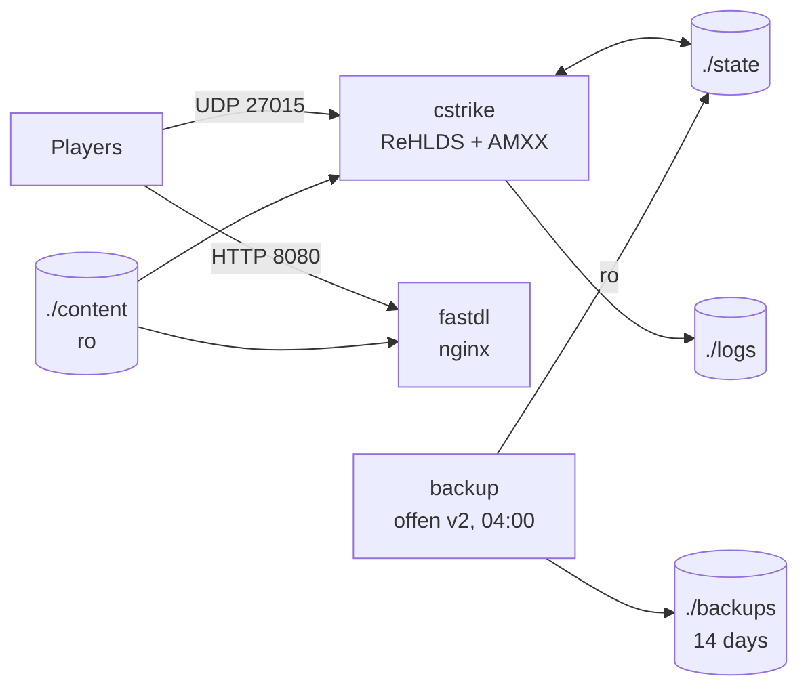

# Architecture: CS 1.6 Nostalgia Multi-Mod

A Counter-Strike 1.6 server for friends where the **map prefix picks the game mode**. It runs on Docker Compose and is deployed with Coolify.

## 1. Stack

| Layer | Component | Why |
|---|---|---|
| Engine | **ReHLDS** | Maintained reimplementation of HLDS: less CPU, fixes for crashes and exploits |
| Game DLL | **ReGameDLL_CS** | Rebuilt `cs.so`; native cvars (auto-bhop, infinite round, buy rules) replace plugins |
| Plugin loader | **Metamod-r** | Light, maintained Metamod fork |
| Scripting | **AMX Mod X 1.10** + **ReAPI** | Admin, votes, stats, per-map plugin loading |
| Dual protocol (on by default) | **Reunion** (official GitHub release, fetched at build) | Lets non-Steam clients (protocol 47/48) join |
| Anti-cheat (on by default) | **WHBlocker** | Server-side wallhack blocking (doesn't send occluded entities) |

Versions are pinned as `ARG`s in `server/Dockerfile`. HLDS itself comes from steamcmd (app 90, `steam_legacy` branch).

## 2. Topology

- **The GoldSrc client can't download over HTTPS.** Coolify's Traefik redirects every port-80 request to HTTPS at the entrypoint level, and no router label can bypass that. So FastDL skips Traefik and nginx publishes **:8080** on the host directly: `http://fastdl.vandal.services:8080/` (DNS A record + firewall rule).
- **The FastDL root is `./content` only**, which holds no configs, secrets or plugins. nginx also uses an allowlist: game-asset extensions only, everything else returns 404.
- **The MOTD is a URL** (`motd.txt` → `<FASTDL_URL>motd.html`). The game DLL truncates an inline `motd.txt` at about 1.5 KB, which is too small for a styled banner.

### Resource limits

| Service | CPU limit | RAM limit | CPU reserved | RAM reserved |
|---|---|---|---|---|
| cstrike | 2.0 | 1024 MB | 0.5 | 256 MB |
| fastdl | 0.5 | 256 MB | 0.1 | 64 MB |
| backup | 0.2 | 128 MB | 0.05 | 32 MB |

The HLDS game loop is single-threaded. Two CPUs leave one core free for 1000 Hz ticks, with headroom for I/O.

## 3. Configuration model

| Kind | Where | Changed by |
|---|---|---|
| Managed config (server.cfg, plugin lists, mode cfgs) | `server/cstrike/` → baked into the image | git + redeploy |
| Third-party plugins / modules | `server/plugins/` → compiled/copied into the image | git + redeploy |
| Secrets & identity (rcon, password, hostname, FastDL URL, admins) | env vars → `env.cfg`, `users.ini` rendered at boot | Coolify env + restart |
| Metamod modules (on by default, fail-fast if missing) | `ANTICHEAT_ENABLED`, `REUNION_ENABLED` (default `1`) → metamod `plugins.ini` rendered at boot | Coolify env + restart |
| Downloadable content | `./content` (host bind), filled by `scripts/bootstrap-content.sh` from `content/maps.txt` + `server/plugins/assets/` | bootstrap + restart |
| Runtime state | `./state` (host bind) | the server itself |

### Boot sequence (`server/entrypoint.sh`)

1. Validate env: `RCON_PASSWORD` is required; values used in cfg files can't contain `"`, `;` or newlines; FastDL must be `http://`.
2. Render `env.cfg`, `motd.txt`, `users.ini` (`ADMINS` get all flags, `MODERATORS` get `bcfiju`: reservation, kick, map, chat, vote, menu) and the metamod `plugins.ini`.
3. Symlink the state files into `/state` and the logs into `/logs`.
4. Symlink `/content` into `cstrike/` (no copying) and prune links whose target was removed.
5. Write `mapcycle.txt` from `mapcycle.all.txt`, keeping only maps whose `.bsp` exists, so votes never pick a missing map.
6. Log a warning for every plugin named in `plugins*.ini` that isn't installed.
7. Drop to the `hlds` user and run `hlds_linux` with `+sys_ticrate 1000`.

## 4. Gameplay: mode per map

`server.cfg` runs on **every** map load and sets the full classic baseline. AMXX then runs
`configs/maps/prefix_<prefix>.cfg` for overrides and loads `configs/maps/plugins-<prefix>.ini` on top of the global `plugins.ini`.
So a mode's cvars never leak into the next map (e.g. `mp_round_infinite 1` from gg_).

Changing mode = changing map: end-of-map vote, `rtv`, `amx_votemap`, or an admin/moderator via `amx_map` / `amxmodmenu`.

| Prefix | Example maps | Mode plugins | Cvar overrides |
|---|---|---|---|
| `de_` | de_dust2, de_dust2_2x2, de_dust, de_aztec, de_abobora | miscstats, c4countdown, backweapons, gp_grenadetrail, nostalgia_parachute | auto-bhop |
| `cs_` | cs_assault, cs_rio, cs_chaves, cs_favela | miscstats, backweapons, gp_grenadetrail, nostalgia_parachute | auto-bhop |
| `gg_` | gg_lego, gg_mini_dust2 | ReGG (regg_core + modules), miscstats, gp_grenadetrail | no freeze/buy/money, infinite round, no time limit |
| `fy_` `aim_` `awp_` | fy_pool_day, fy_iceworld, aim_aztec, awp_india | miscstats, nostalgia_vampire, backweapons, gp_grenadetrail, nostalgia_parachute | no freeze, no buy, 1.5 min rounds, auto-bhop |
| `zm_` | zm_toxic_house_b, zm_ice_attack, zm_dust2_final | Zombie Plague Special 4.5 (core, classes, extra modes), gp_grenadetrail, nostalgia_parachute | 3 min rounds, no freeze, no buy, auto-bhop |

Global plugins (every map): AMXX core and menus, `adminvote`, `statsx` (`/rank`, `/top15`), `restmenu`,
**Galileo** (end-of-map vote, `rtv` at 51%, `nominate`), `bullet_damage`, `say_resetscore` (`/rs`), `sank_sounds` (keywords in `configs/SND-LIST.CFG`).
`mapchooser.amxx` and `nextmap.amxx` are disabled because Galileo replaces them.

**Player votes.** `amx_default_access "jz"` gives every player the ADMIN_VOTE flag, so anyone can run the stock
`amx_votekick`, `amx_voteban` and `amx_votemap`, with a 51–60% ratio and a 90 s cooldown.

## 5. Data, backup and restore

AMXX has no database server. State is in flat files, and all of it is in `./state`:

| File | Content |
|---|---|
| `amxx/csstats.dat` | `/rank`, `/top15` |
| `amxx/vault/` | nVault (mod progress, e.g. ZP ammo packs) |
| `banned.cfg`, `listip.cfg` | SteamID / IP bans |
| `reunion_salt` | Auto-generated Reunion salt (when `REUNION_SALT` is unset); non-Steam IDs depend on it |

Admins are **not** state: they come from `ADMINS` (default `STEAM_0:1:26191905`) / `MODERATORS`.
Logs go to `./logs` and are not backed up. Maps and configs are rebuilt from git and `./content`.

- **Backup:** `offen/docker-volume-backup` tars `./state` every day at 04:00 into `./backups/cs16-state-<ts>.tar.gz` and keeps 14 days (pruning only touches the `cs16-state-` prefix). The archive is a few MB.
- **Restore:** `scripts/restore.sh <archive>` stops `cstrike`, saves the current state to `backups/pre-restore-<ts>.tar.gz`, extracts with `--strip-components=2` (the archive root is `backup/cs-state/`) and starts the server again.

## 6. Trade-offs

| Decision | Cost | Mitigation |
|---|---|---|
| Players get vote access (`j`) | Anyone can start a vote or `amx_cancelvote` | Ratios + `amx_vote_delay 90`; remove `j` from `amx_default_access` if abused |
| Backup runs while the server is up | A write landing mid-tar could make that one snapshot inconsistent | Files are tiny and written at map change; offen's stop-during-backup would need the Docker socket mounted, which isn't worth the exposure |
| Plugins are drop-in, not fetched at build | Manual step before the first full deploy | `MANIFEST.md` + boot warnings |
| FastDL bypasses Traefik | Plain HTTP on a public port | Content is public game assets anyway; allowlist plus a root dir with no secrets |
| WHBlocker on by default, fail-fast | No boot until its binary is committed (dev-cs.ru only) | `ANTICHEAT_ENABLED=0` opt-out; clear boot error |
| Jailbreak dropped | No `jb_` mode | No trustworthy maintained source; re-add as a drop-in with its own `plugins-jb.ini` |
| Own vampire/parachute plugins | Small code to own | ~30/90 lines on ReAPI; parachute keeps the classic "hold E" behaviour without a required model |
| `steam_legacy` HLDS branch | Not the latest Valve build | Most compatible base for ReHLDS; change `HLDS_BETA` to try another |

## 7. Deviations from the design conversation

| Original idea | Problem | Implemented |
|---|---|---|
| `apendua/rehlds:latest` image | Not pinned or auditable | Own Dockerfile with pinned upstream releases |
| `configs/maps/gg.cfg` | AMXX runs `prefix_<prefix>.cfg` | `prefix_gg.cfg`, … |
| Mode cvars only in mode cfgs | They leak into the next map | Full baseline in `server.cfg` (re-run every map) |
| `+rcon_password` / `+sv_password` start params | `server.cfg` overrides them on each map change | `env.cfg` rendered from env, run by `server.cfg` |
| `BACKUP_INCLUDE_PATTERNS` | Not an offen option | State isolated in `./state`; back up that directory |
| nginx `allow all` per extension | Unlisted extensions were still served | Default 404 + allowlist + content-only root |
| `auto_bhop.amxx`, `sv_parachute`/`amx_autobhop` cvars | Plugin not needed / made-up cvar names | ReGameDLL `mp_autobunnyhopping`; plugin cvars stay in each plugin's own cfg |
| `/votekick` via adminvote | Stock votes are admin-only | `amx_default_access "jz"` |
| Inline HTML `motd.txt` | Truncated at ~1.5 KB | MOTD served as `motd.html` via FastDL |
| `27015/tcp`, `version:`, `container_name` | Not used / obsolete / clashes with Coolify | Removed |
| `sv_cmdrate`, `fps_max` in server.cfg | Client cvars | Removed (server rate is `sys_ticrate`) |
